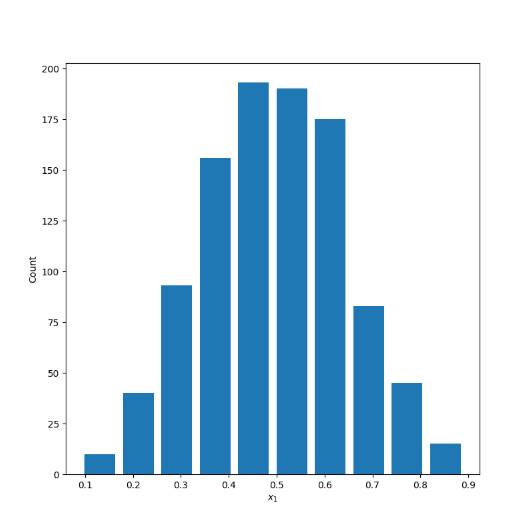
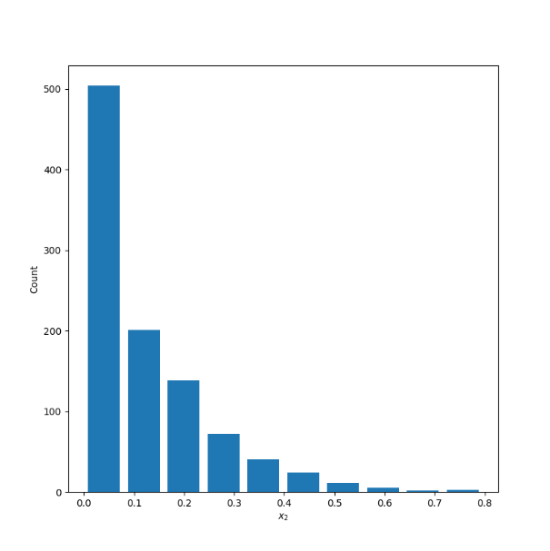
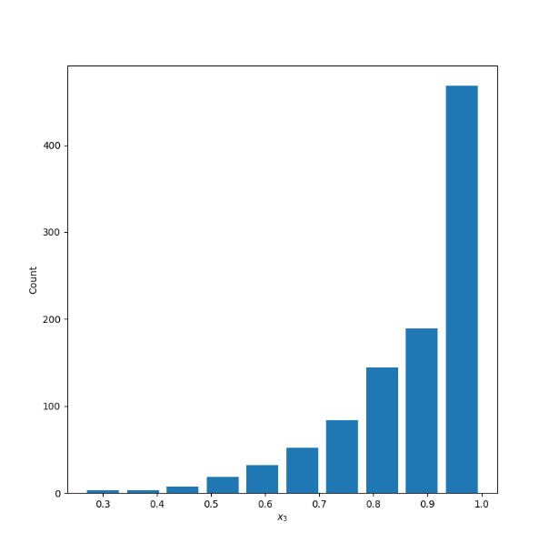
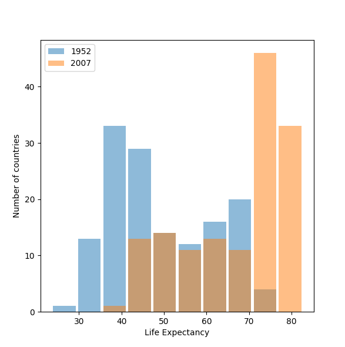
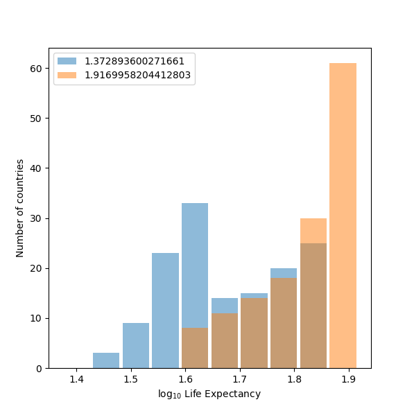
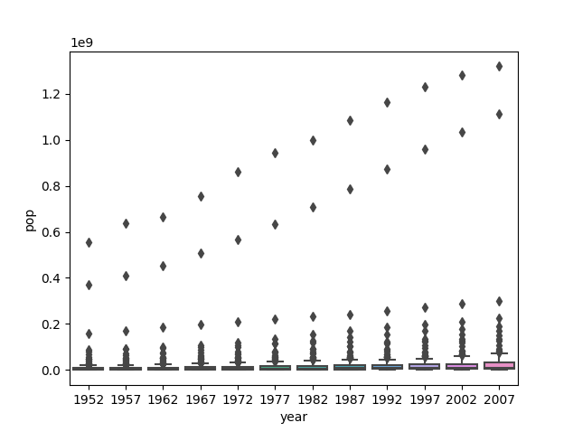
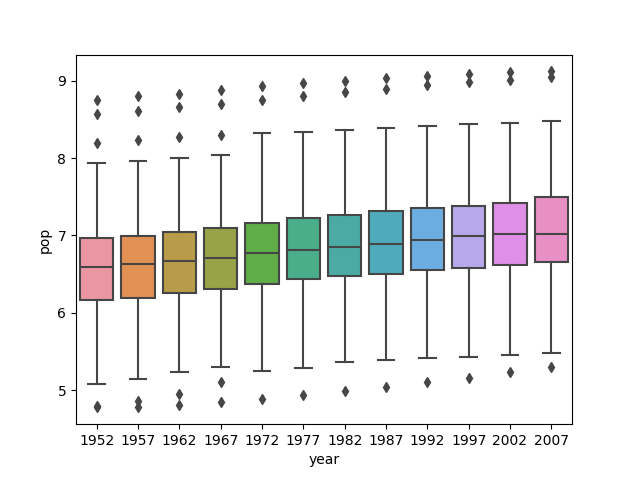

# Project 2

## 1 

Continuous data is numerical data that can take on a range of values, such as age or income. Ordinal data is similar to continuous data but only the order of the data matter rather than the difference between them, such as a list of the top five finishers in a race. While the values of ordinal data are numeric, they are described and used categorically, so you cannot add different ordinal values together to get another value. Nominal data are labels, such as the names of countries, or gender. 

To use all three kinds of data in practice, you could use a model of countries, including their GDP per capita and CPI ranking. The following table shows how it could be organized:

| Ranking of Corruption Perception Index    | Country | GDP Per Capita (USD) |
| ----------- | ----------- | --------------|
| 1    | New Zealand      | 42,084.35|
| 1   | Denmark        | 60,170.34 |
| 3    | Finland       | 48,782.79 |
| 3   | Switzerland      | 81,993.73 |
| 3    | Sweden       | 51,615.02 |
| 3   | Singapore       | 65,233.28 |
| 7    | Norway       | 75,419.63 |

The first column is an example of ordinal data, where numerical values are used in a ranking rather than as a numerical count. The second column is categorical data as it includes the label of country names. The last column includes continuous data, as GDP is a quantitative value that can take on a range. In this model, the first column would be classified as a feature, with each country's GDP per capita hypothetically being the dependent, target value - should there be a correlation between CPI ranking and GDP.

## 2 

### X1 - Normally Distributed 

Mean: .4957

Median: .4965

### X2 - Right Skewed

Mean: .1225

Median: .0757

### X3 - Left Skewed

Mean: .8805

Median: .9199

## 3

### Raw Data

### Logarithmic Transformation

The plot shown after applying the logarithmic transformation to the raw data best communicates the change in life expectancy among all included countries from 1952 to 2007. It is much easier to see the difference between the two years in the second plot than in the first, as the second one more clearly demonstrates the dramatic increase in life expectancy worldwide from 1952 to 2007. Scaling down the values while preserving the variation of the variables through the logarithmic transformation allows for the second plot to be more readable. 

## 4 

### Raw Data

### Logarithmic Transformation

The second graph of the logarithmic transformation of the population variable clearly best communicates the change in population amongst all countries from 1952 to 2007. While the graph of the raw data is very concentrated and difficult to read, the second graph is much more spread out  and shows the gradual increase in average population over the years. The values are too large in the first, raw data set, making the plots very concentrated around smaller values while including distinct outliers. Scaling the data down allows for a clearer plot that easily demonstrates how population changed over the given years. 

